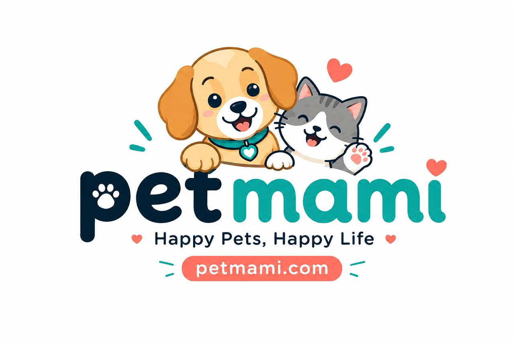

# 🐾 PetMami — Online Pet Store (Kuwait)

PetMami is a bilingual **English / Arabic (RTL)** pet store website for Kuwait — premium food,
toys and care essentials with same-day delivery.
Static **HTML + Tailwind** design first, later integrated into **.NET (ASP.NET / Razor)**.

> ### Phase 1 scope: Cats and Dogs, no Services
>
> Everything outside that scope is **commented out in the markup, not deleted**. Each parked block
> is wrapped in an HTML comment that starts with `PHASE 2`, so bringing it back means deleting the
> two comment markers around it.
>
> | Parked | Where to find it |
> |---|---|
> | Birds · Fish · Small Pets · Reptiles | header nav, mobile drawer and footer (`PHASE 2 · PET TYPES`), plus the four extra cards on the home page |
> | Services (grooming, vet, aquarium) | header nav, drawer, footer (`PHASE 2 · SERVICES`), the third hero slide, the hero side card and the whole services section on the home page |
> | `services.html` | still generated and complete, just not linked from anywhere |
>
> The category photos (`images/categories/birds.jpg`, `fish.jpg`, `small-pets.jpg`, `reptiles.jpg`)
> and the service photos (`images/misc/`) are all still in the repo, so nothing needs re-sourcing.



Market research and the full design plan: [`../PETMAMI_WEBSITE_DEVELOPMENT_PLAN.md`](../PETMAMI_WEBSITE_DEVELOPMENT_PLAN.md)

---

## 1. How to open it

**Just double-click `index.html`.** No server, no build step — Tailwind loads from a CDN and
every asset path is relative.

To switch the whole site to Arabic (RTL), open **Account → Language** (`account.html`) and press
the language button. The choice is remembered in local storage, so every page follows. The switch
deliberately does **not** sit in the header — it lives in the profile, the same way BoboMart does it.

---

## 2. Design Language

Warm, friendly and rounded — taken straight from the PetMami logo.

| Token | Color | Usage |
|---|---|---|
| `brand-navy` | `#0F2B3C` | Headings, body text, footer, offer strip |
| `brand-teal` | `#14A395` | Primary — buttons, links, active states, "mami" in the logo |
| `brand-tealdark` | `#0E7F74` | Hover and small text on white |
| `brand-coral` | `#F2705F` | Accent — sale badges, wishlist, "Buy now" |
| `brand-gold` | `#E9A64A` | Ratings, best-seller badges, deal banners |
| white | `#FFFFFF` | Page background — plain white throughout |

Rules:
- White background everywhere; rounded corners, soft shadows, plenty of white space.
- Colour is used sparingly and only from the brand palette.
- Fonts: **Fredoka** (headings) + **Nunito** (body) for English; **Baloo Bhaijaan 2** + **Tajawal** for Arabic.
- Arabic gets a taller line-height and never letter-spacing (it breaks the letter joins).

---

## 3. Pages

| Page | Description |
|---|---|
| `index.html` | Offer strip, header, **Shop by pet (Cats / Dogs, first on the page)**, top promo banner, hero slider, deals of the day + countdown, best sellers, pet-profile CTA, brands, guides, reviews, newsletter |
| `category.html` | Product listing — filters (brand, price, life stage, diet), sort, grid, pagination |
| `product.html` | Gallery, variants, Subscribe & Save, feeding guide, reviews, related products, sticky mobile buy bar |
| `cart.html` | Cart lines with steppers, coupon, free-delivery progress, summary |
| `checkout-address.html` | Contact + **Kuwait address** (governorate → area → block → street → house) + delivery slots |
| `checkout-payment.html` | KNET, card, Apple Pay, cash on delivery |
| `checkout-confirm.html` | Order confirmation, tracking timeline, and the **KNET failure block** |
| `login.html` · `register.html` | Mobile OTP and email sign-in, account creation |
| `account.html` | Dashboard — points, orders, my pets, subscriptions |
| `offers.html` · `brands.html` | Deals with countdown, brand directory |
| `services.html` | Grooming and vet consultation + booking form — **parked**, not linked from the navigation |
| `blog.html` | Pet guides and care tips |
| `about.html` · `help.html` · `delivery-info.html` · `returns.html` · `terms.html` | Static and policy pages |
| `404.html` | Error page |

---

## 4. Core Features

### 4.1 Responsive app/website behaviour
- **Mobile (< 768px):** app-like, with a fixed **bottom tab bar** — Home, Shop, Cart, Wishlist, Account, plus a slide-in menu.
- **Desktop (≥ 1024px):** classic layout — logo, search, actions, then a category nav bar (Cats · Dogs · Brands · Pet Guides · Offers).

### 4.2 Language support (EN / AR)
- Language switcher lives in **Account → Language** (not the header); Arabic flips the whole layout to **RTL**.
- Every translatable element carries `data-en` / `data-ar` (and `data-placeholder-en` / `-ar` for inputs,
  `data-html-en` / `-ar` where the text contains markup).
- The selected language persists in local storage.

### 4.3 Kuwait specifics
- Prices in **KD with 3 decimals** (`KD 8.750`); prices, phone numbers and SKUs stay LTR inside Arabic text via `.pm-ltr`.
- Mobile numbers: `+965` prefix, 8 digits, pattern-validated.
- Address: **Governorate → Area → Block → Street → Avenue → House → Floor → Apartment**.
  All six governorates and their areas are in `js/main.js` (`AREAS`).
- Payment: **KNET** (default), Visa/Mastercard, Apple Pay, cash on delivery.
- KNET failure page shows the required fields: Payment ID, Result, Transaction ID, Auth, Reference No., Track ID, Amount, Date.
- Free delivery over **10 KD**; same-day cut-off 6 PM; 3-hour delivery slots; express option.
- Friday–Saturday weekend in the footer hours; **WhatsApp** button on every page.

### 4.4 Commerce features
- Deal of the day with a live **countdown** to midnight.
- **Subscribe & Save 10%** on food and litter, with a delivery frequency picker.
- **My Pets** profiles (breed, age, weight) driving food recommendations.
- Loyalty points shown on the product page, confirmation page and account dashboard.

---

## 5. Tech Stack

| Layer | Choice | Why |
|---|---|---|
| Markup | Plain HTML5 | Hands over cleanly to .NET Razor views / partials |
| CSS | **Tailwind CSS (CDN)** | No build step, works from `file://`, plays well inside Razor as plain classes |
| Custom CSS | `css/custom.css` | Brand tokens, RTL flips, product-card clamp, form focus rings |
| Fonts | Google Fonts | Fredoka + Nunito (EN), Baloo Bhaijaan 2 + Tajawal (AR) |
| Images | Real Creative-Commons photos in `images/` | Replaced by real product photography later |
| Icons | **Inline SVG** (Lucide-style) | An external sprite cannot load over `file://`; inline icons always render |
| JS | Small vanilla JS (`js/main.js`) | Language toggle, slider, countdown, cart steppers, filters, OTP |

### .NET integration conventions
- Every component carries a **semantic class** (`pm-*` prefix) alongside Tailwind utilities —
  `pm-product-card`, `pm-offer-strip`, `pm-header` — so .NET can target them without touching utility classes.
- Repeatable blocks are marked `<!-- REPEATABLE: ... -->` → each becomes a Razor partial fed by a model loop.
- Shared blocks are marked `<!-- PARTIAL: _Header -->`, `<!-- PARTIAL: _Footer -->`, `<!-- PARTIAL: _AccountNav -->`.
- Text elements carry `data-en` / `data-ar` → later replaced by `.resx` resources or a DB translation table.
- Forms already use the expected ViewModel names (`name="Address.Block"` → `asp-for="Address.Block"`),
  carry an anti-forgery comment marker and empty `data-valmsg-for` spans for unobtrusive validation.
- No inline JavaScript — behaviour binds to ids and `data-*` hooks only.

Full mapping table: [`docs/razor-conversion-map.md`](docs/razor-conversion-map.md)

---

## 6. Project Structure

```
petmami-html/
├── README.md
├── index.html              # Home — top banner, hero, deals, best sellers, brands, blog
├── category.html           # Product listing with filters
├── product.html            # Product details
├── cart.html               # Cart
├── checkout-address.html   # Checkout step 1 — Kuwait address + delivery slot
├── checkout-payment.html   # Checkout step 2 — KNET / card / Apple Pay / COD
├── checkout-confirm.html   # Checkout step 3 — confirmation + KNET failure block
├── login.html              # Sign in (mobile OTP + email)
├── register.html           # Create account
├── account.html            # Dashboard — orders, pets, subscriptions, points
├── offers.html             # Deals with countdown
├── brands.html             # Brand directory
├── services.html           # Grooming · vet + booking form (parked — not linked yet)
├── blog.html               # Pet guides
├── about.html · help.html · delivery-info.html · returns.html · terms.html
├── 404.html
├── css/
│   └── custom.css          # Small overrides on top of Tailwind (RTL, cards, forms)
├── js/
│   └── main.js             # Language toggle, slider, countdown, cart, filters, OTP
├── images/
│   ├── brand/logo.jpg      # Brand logo
│   ├── banners/            # Hero and promo banners
│   ├── categories/         # Cat, dog, bird, fish, small pet, reptile tiles
│   ├── products/           # Product photos
│   ├── blog/ · misc/       # Article and service photos
│   └── IMAGE-CREDITS.json  # Licence and attribution for every photo
└── docs/
    └── razor-conversion-map.md
```

---

## 7. Images — licensing and replacement

All photography is **Creative Commons / public domain**, fetched from Openverse and Wikimedia
Commons. `images/IMAGE-CREDITS.json` lists the title, creator, licence and source URL for every file.

> **Before go-live:** replace the product photos with PetMami's own product shots. These are
> topical placeholders, not real packshots, and a few (`products/cat-wet-food`, `products/pet-shampoo`,
> `blog/nutrition`) are only loosely on-subject. If any CC BY / CC BY-SA images are kept, the credits
> must be published somewhere on the site. Icons are inline SVG (Lucide-style, MIT).

---

## 8. Roadmap

- [x] Requirements, market research & design plan
- [x] Design language from the logo (colours, fonts, components)
- [x] Home page (top banner, hero slider, deals + countdown, best sellers, services, blog)
- [x] Category, product, cart pages
- [x] Checkout (Kuwait address → payment → confirmation, incl. KNET failure block)
- [x] Login / register with OTP
- [x] Account dashboard (orders, pets, subscriptions, points)
- [x] Offers, brands, services + booking, blog
- [x] Scope trimmed to Cats + Dogs for phase 1; Services and the other pet types commented out
- [x] Static pages (about, help & FAQ, delivery info, returns, terms & privacy) and 404
- [x] EN / AR with full RTL mirroring
- [ ] Native Gulf-Arabic copy review
- [ ] Real product photography and the vector logo
- [ ] .NET integration (Razor views, dynamic data)
- [ ] Payment gateway (MyFatoorah / Tap / UPayments / Hesabe)
- [ ] Phase 2: uncomment the `PHASE 2` blocks — birds, fish, small pets, reptiles and Services
